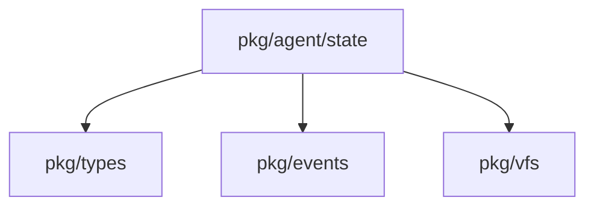
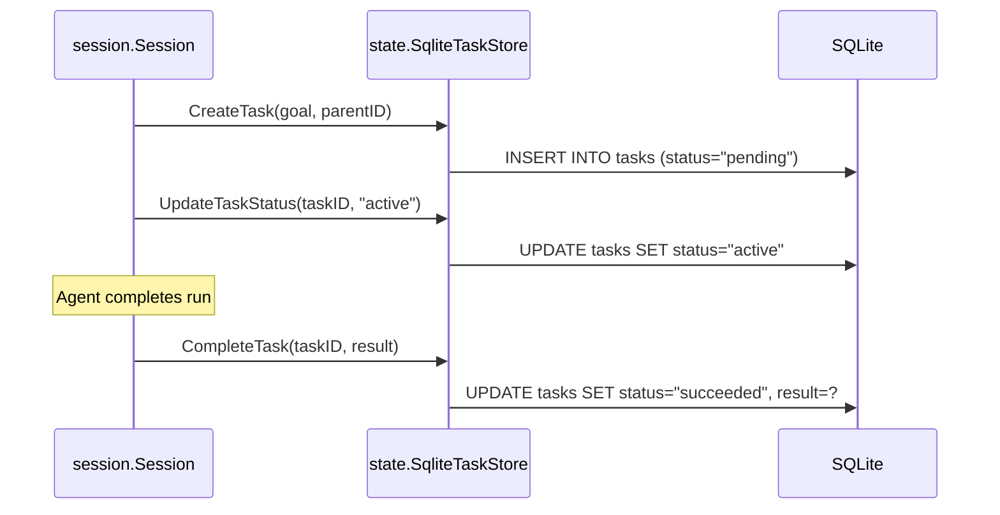

# Package: pkg/agent/state

## Purpose
The `state` package provides the persistence layer for tasks and artifacts. It implements a SQLite-backed `TaskStore` that ensures task states, results, and relationships (parent/child) are durable across system restarts. It also manages an artifact index, enabling efficient lookup and retrieval of files generated during agent runs.

## Exported Types/Functions
- `TaskStore`: Interface for managing task lifecycle (creation, updates, queries).
- `SqliteTaskStore`: Concrete SQLite implementation of `TaskStore`.
- `SqliteArtifactIndex`: Manages indexing and retrieval of artifacts.
- `Task`: Struct representing a persistent task unit.
- `Run`: Struct represented an execution instance of a task.

## Package Dependencies

## Task Persistence Flow

## Invariants
- Task IDs must be globally unique (UUIDs recommended).
- The `SqliteTaskStore` must use transactions for status updates to prevent race conditions during concurrent polling.
- Artifact paths stored in the index must be relative to the VFS root or a consistent base path.
- The state of a task must only transition between valid lifestages as defined in the system's global state machine.
