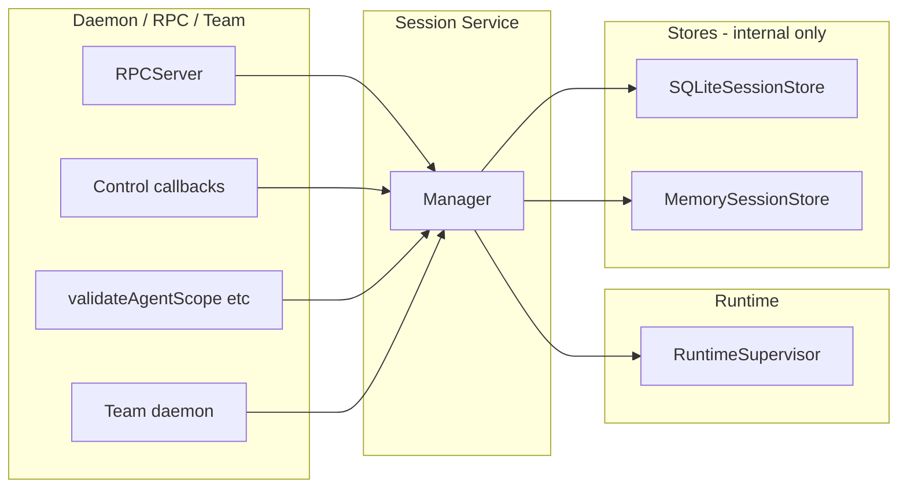
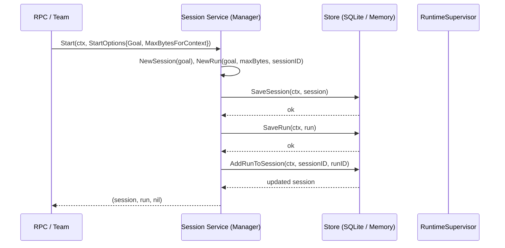
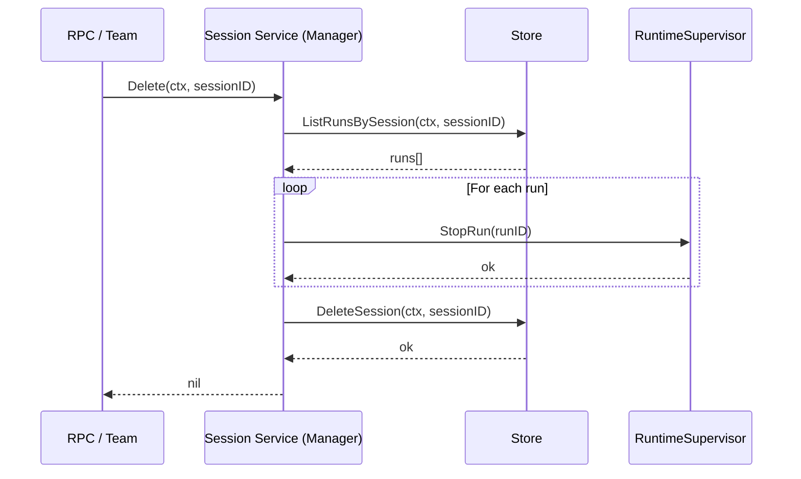

# Package: pkg/services/session

## Purpose

The session service is the **single entry point** for all session and run data in the daemon. It abstracts persistence behind a clear API: the daemon, RPC server, and team daemon use only this service to load/save sessions and runs. Callers do not use `internal/store` or raw store types directly.

## Key types

| Type                  | Role                                                                                                  |
| --------------------- | ----------------------------------------------------------------------------------------------------- |
| **Service**           | Public interface: session CRUD, runs, activities. Implemented by **Manager**.                         |
| **Manager**           | Implements `Service`; delegates to a **Store** and uses a **RuntimeSupervisor** for `Delete`/`Stop`.  |
| **Store**             | Internal interface: session + run + activity persistence. Implemented by SQLite and in-memory stores. |
| **RuntimeSupervisor** | Stops/resumes agent runtimes; used by `Delete` and `Stop`.                                            |

## Service API

### Session

| Method                               | Meaning                                                                             |
| ------------------------------------ | ----------------------------------------------------------------------------------- |
| `LoadSession(ctx, sessionID)`        | Read persisted session.                                                             |
| `SaveSession(ctx, session)`          | Persist session (e.g. after rename, model change).                                  |
| `Start(ctx, opts)`                   | Create session + first run, persist, link, return. Single entry point for creation. |
| `Delete(ctx, sessionID)`             | Stop all runs, then remove session and related data.                                |
| `ListSessionsPaginated(ctx, filter)` | Query sessions with pagination and filters.                                         |
| `CountSessions(ctx, filter)`         | Count sessions matching filter.                                                     |

### Runs

| Method                                   | Meaning                                             |
| ---------------------------------------- | --------------------------------------------------- |
| `LoadRun(ctx, runID)`                    | Load a run by ID.                                   |
| `SaveRun(ctx, run)`                      | Persist run (status, metadata, etc.).               |
| `ListRunsBySession(ctx, sessionID)`      | All runs for a session.                             |
| `ListChildRuns(ctx, parentRunID)`        | Child runs for a parent (subagents).                |
| `AddRunToSession(ctx, sessionID, runID)` | Link an existing run to a session (e.g. team flow). |

### Activities

| Method                                      | Meaning                            |
| ------------------------------------------- | ---------------------------------- |
| `ListActivities(ctx, runID, limit, offset)` | Paginated activity list for a run. |
| `CountActivities(ctx, runID)`               | Total activity count for a run.    |

### StartOptions

Used by `Start(ctx, opts)`:

- **Goal** – Initial goal/prompt.
- **MaxBytesForContext** – Context window size for the first run.
- **TaskID** (optional) – When starting a session for a task.
- **ParentRunID** (optional) – For sub-agent sessions.

## Architecture

- **Only the Manager** talks to the store. Daemon, RPC, and team daemon hold a `Service` (the Manager) and never touch the store for session/run/activity.
- **Store** is an internal implementation detail. Production uses `internal/store.SQLiteSessionStore`; tests use `pkg/store.MemorySessionStore`. Both implement the session service **Store** interface.

## Data flow: session creation (Start)

## Data flow: session deletion (Delete)

## Store interface (internal)

The Manager’s **Store** extends `pkg/store.SessionStore` with run and activity methods:

- From **SessionStore**: `LoadSession`, `SaveSession`, `DeleteSession`, `ListSessionsPaginated`, `CountSessions`, plus lister/reader methods.
- **Runs**: `LoadRun`, `SaveRun`, `ListRunsBySession`, `ListChildRuns`, `AddRunToSession`.
- **Activities**: `ListActivities`, `CountActivities`.

Implementations:

- **internal/store.SQLiteSessionStore** – Production; delegates to package-level SQLite helpers.
- **pkg/store.MemorySessionStore** – Tests; in-memory maps for sessions, runs, and activities.

## Daemon wiring

- The daemon builder creates the SQLite session store and the runtime supervisor, then builds the session service:

  `sessionService = pkgsession.NewManager(cfg, sessionStore, supervisor)`

- RPC config receives `Session: sessionService`. Control callbacks and validators use `sessionService.LoadSession` / `SaveSession` (never the store directly).
- Team daemon does the same: it constructs a Manager over the team’s store and supervisor and passes that as the session service to the team RPC config.

## Invariants

1. **Single API**: All session/run/activity access from the daemon goes through `pkgsession.Service`. No direct use of `internal/store` or raw store types for that data.
2. **Orchestrated delete**: `Delete` is the only way to remove a session from the service; it stops runs first, then deletes storage. Low-level `DeleteSession` exists only on the Store and is not exposed on the Service.
3. **Start = create + persist**: `Start` creates the session and first run, persists both, links them via `AddRunToSession`, and returns. It does not start an agent runtime; that is done elsewhere (e.g. RPC/team flow).
4. **Supervisor only for lifecycle**: The Manager uses the RuntimeSupervisor only for `Stop` and `Delete` (stopping runs). All reads and writes go through the Store.
