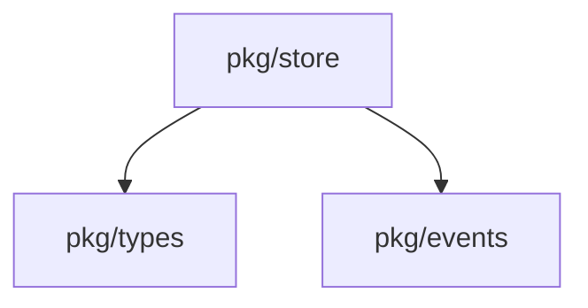
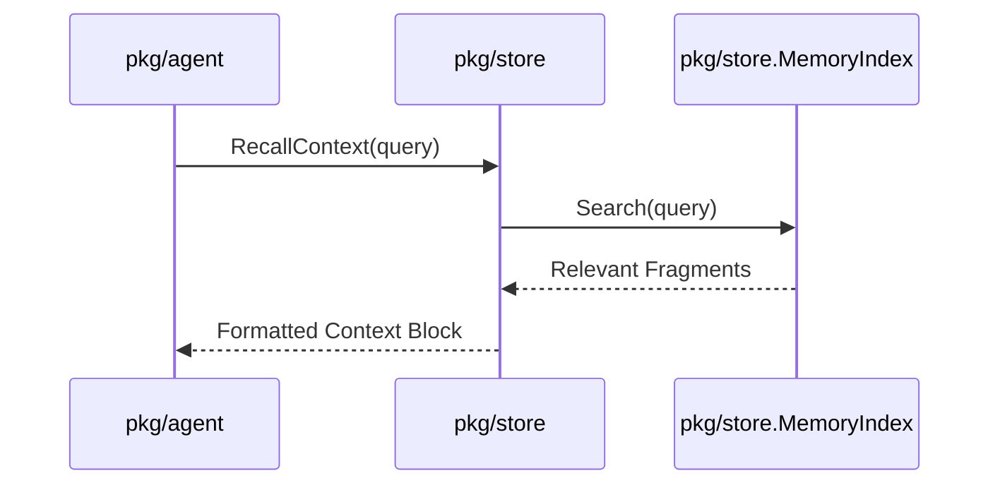

# Package: pkg/store

## Purpose
The `store` package manages the agent's "memory"—the logs and context from previous conversations and tasks. It provides a structured way to store and retrieve messages, tool results, and daily context, allowing agents to maintain continuity over time and across different sessions.

## Exported Types/Functions
- `DailyMemoryStore`: Interface for managing conversation and task logs organized by day.
- `MemoryIndex`: Interface for indexing and searching archived memory.
- `AppendEvent`: Function for adding new events/messages to the current run's log.
- `LoadContext`: Retrieves historical context relevant to the current task.

## Package Dependencies

## Runtime Flow: Memory Retrieval

## Invariants
- Memory entries must be associated with a `RunID` or `SessionID` to maintain lineage.
- The `DailyMemoryStore` should ensure that large logs are handled efficiently (e.g., through streaming or chunking).
- Access to memory should be read-only for the agent during a standard run, except for appending new events to the current run's log.
