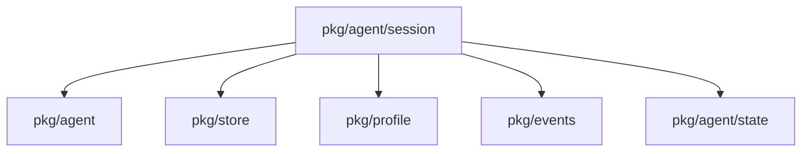
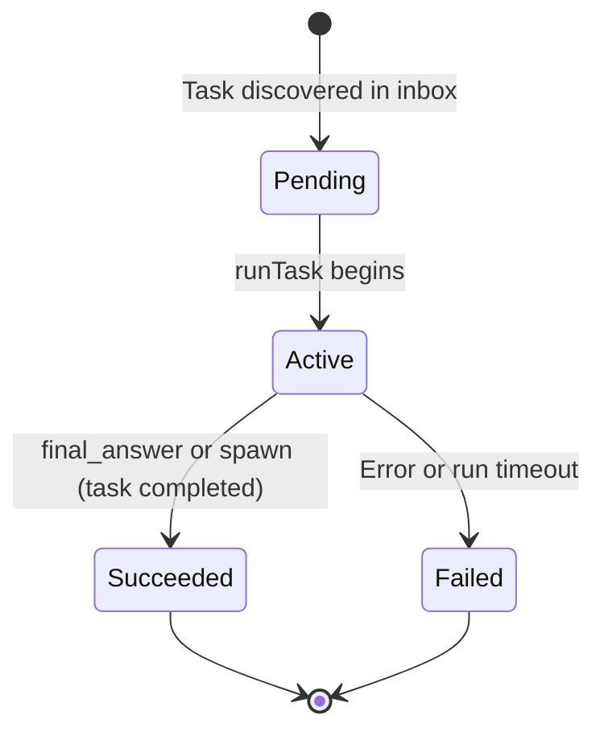
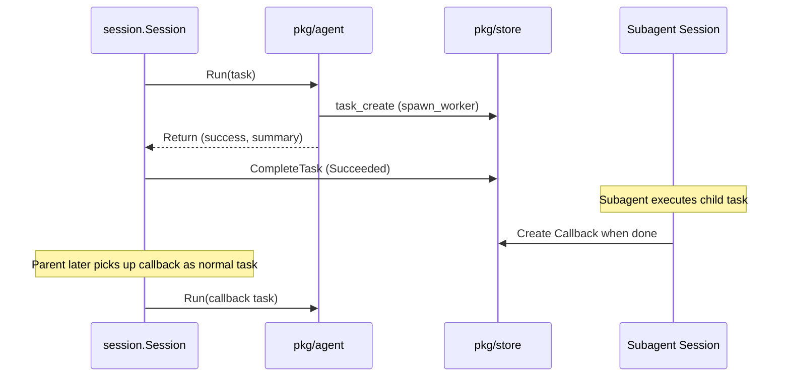

# Package: pkg/agent/session

## Purpose

The `session` package is the orchestrator for task execution and lifecycle management. It manages an "inbox" of tasks, handling their progression from discovery to completion. It bridges the gap between the stateless `agent` loop and the persistent `store`, ensuring tasks are run to completion: when the parent spawns, the coordination task is completed (Succeeded) with the agent’s summary, and callbacks are created when subagents finish—no delegation state or resume.

## Exported Types/Functions

- `Session`: The main coordinator struct for task execution.
- `New(cfg Config)`: Initializes a new session with agent, store, and profile configuration.
- `Session.Run(ctx context.Context)`: The entry point for processing the session's task inbox.
- `Session.SetPaused(paused bool)`: Controls the execution state of the session.
- `Config`: Configuration struct for session behavior, including delegation roles.

## Package Dependencies

## Task State Machine

Callback tasks are separate tasks (Pending → Active → Succeeded/Failed). Coordination tasks are not transitioned to a "Delegated" state.

## Runtime Flow: Subagent Spawn and Callbacks

## Invariants

- When the parent spawns, its coordination task is completed (Succeeded); callbacks are normal tasks that the parent processes when they appear.
- Session heartbeats are the primary mechanism for detecting changes in the external task store (e.g., new callback tasks).
- The session must ensure that the VFS state and LLM history are correctly persisted where needed for task execution.

## Heartbeats

Heartbeats are configured in `profile.yaml` under `heartbeat`. Set `heartbeat_enabled: false` to disable heartbeats without removing the entries (useful for toggling without editing the job definitions).
