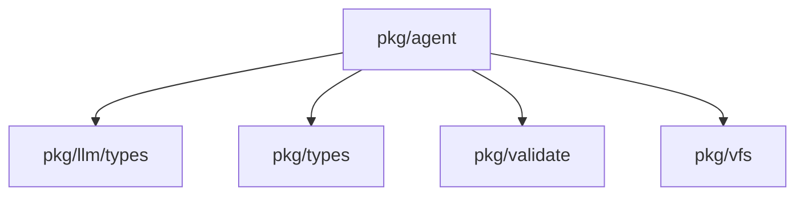
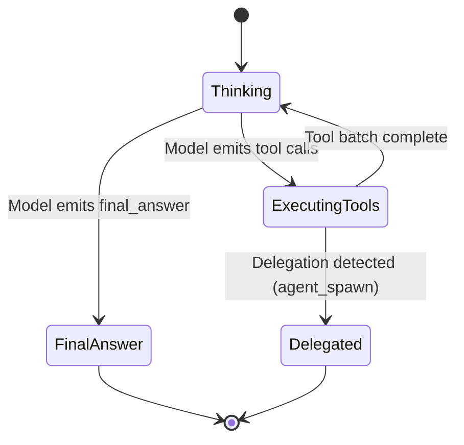

# Package: pkg/agent

## Purpose
The `agent` package implements the core intelligence and decision-making loop of the system. It coordinates the interaction between the LLM client and the host environment, managing prompt construction, message history truncation, and tool execution. It is responsible for interpreting model outputs as tool calls and ensuring that the agent's progress is correctly propagated to the caller.

## Exported Types/Functions
- `Agent`: Interface defining the capabilities of an agent (typically `Run` and `RunConversation`).
- `DefaultAgent`: Concrete implementation of the minimalist streaming agent loop.
- `HostExecutor`: Interface for executing tools on the host.
- `RunResult`: Struct capturing the outcome of an agent run (final answer, artifacts, etc.).
- `DefaultSystemPrompt`: Function providing the base set of instructions for the agent.
- `WithDelegationDetector`: Context helper for detecting subagent spawning.

## Package Dependencies


## Agent Loop State Machine


## Runtime Flow
```mermaid
sequenceDiagram
    participant Caller as pkg/agent/session
    participant Loop as agent.runConversation
    participant LLM as pkg/llm
    participant Exec as HostExecutor

    Caller->>Loop: Call Run(goal)
    loop until FinalAnswer or Delegated
        Loop->>LLM: Request next completion
        LLM-->>Loop: Stream content & tool calls
        Loop->>Exec: Execute tool batch (parallel)
        Exec-->>Loop: Tool results
        Loop->>Loop: Update message history
        Loop->>Loop: Check for delegation
    end
    Loop-->>Caller: Return RunResult
```

## Invariants
- The agent's message history must always start with a system instruction.
- Tool results must be appended to the history in the same order as the tool calls to maintain LLM context coherence.
- The `HostExecutor` must handle errors gracefully to prevent the entire agent loop from crashing.
- History truncation must preserve the system prompt and recent context to maintain "sanity".
