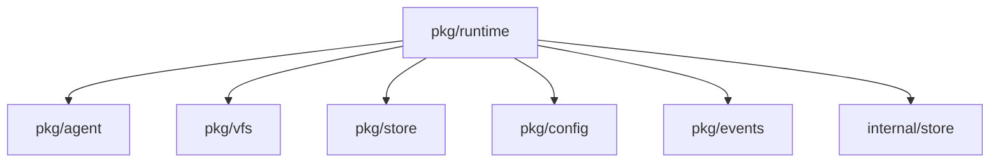
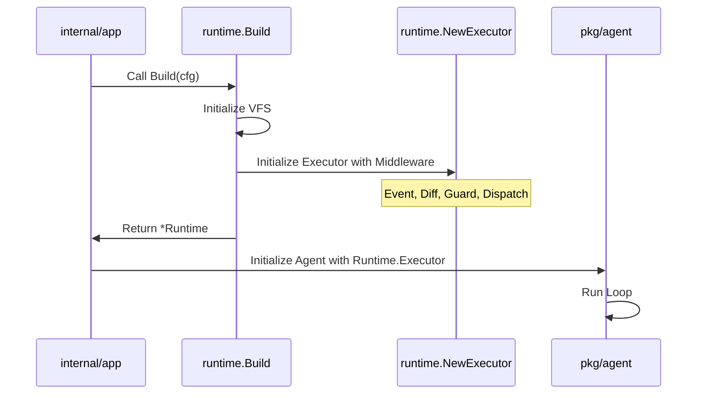

# Package: pkg/runtime

## Purpose
The `runtime` package serves as the primary factory and supervisor for agent execution environments. It encapsulates the construction of virtualized resources—including the file system (VFS), tool executors, and model contexts—ensuring that agents operate within a consistent and isolated boundary. It provides the `Build` function as the central entry point for initializing the infrastructure required for a specific run.

## Exported Types/Functions
- `Runtime`: Struct containing the operational environment (FS, Executor, Browser, etc.).
- `BuildConfig`: Configuration parameters for building a new runtime.
- `Build(cfg BuildConfig)`: Main constructor for `Runtime`.
- `NewExecutor(base *agent.HostOpExecutor, opts ExecutorOptions)`: Constructs the middleware-wrapped host executor.
- `ChainExecutor(base agent.HostExecutor, middleware ...HostOpMiddleware)`: Composes multiple host operation middlewares.
- `HostOpMiddleware`: Interface for intercepting and augmenting host operations.

## Package Dependencies

## Runtime Flow

## Invariants
- A `Runtime` must always have a valid `FS` (Virtual File System) to prevent host escapes.
- All host operations must pass through the `Executor` middleware chain for event emission and safety checks.
- The `WorkdirBase` must be an absolute path and consistent with the VFS root.
- Resource cleanup (e.g., browser profiles) is managed via the `Shutdown` method.
