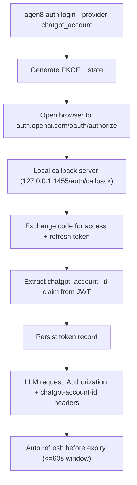

# ChatGPT Account Auth (`chatgpt_account`)

This mode lets Agen8 run without `OPENROUTER_API_KEY`/`OPENAI_API_KEY` by using browser OAuth and local token refresh.

By default, this mode is strict: only OpenAI models are allowed. Non-openai models fail fast unless you explicitly enable API-key fallback.

## Enable

```sh
export AGEN8_AUTH_PROVIDER=chatgpt_account
agen8 auth login --provider chatgpt_account
agen8 auth status --provider chatgpt_account
```

Or set it per command:

```sh
agen8 --auth-provider chatgpt_account daemon
```

Optional fallback for non-openai models (`config.toml`):

```toml
[auth]
provider = "chatgpt_account"
allow_api_key_fallback_for_non_openai = true
```

When enabled, non-openai models route through `OPENROUTER_API_KEY`.

## Token Storage

- Path: `${AGEN8_DATA_DIR}/auth/chatgpt_oauth.json`
- Mode: `0600`
- Contents: provider, access token, refresh token, expiry, account id, token type, updated timestamp

## Flow



## Request Behavior in `chatgpt_account` Mode

- OpenAI models:
  - Base URL: `https://chatgpt.com/backend-api/codex`
- Injected headers:
  - `Authorization: Bearer <access_token>`
  - `chatgpt-account-id: <account_id>`
  - `OpenAI-Beta: responses=experimental`
  - `originator: codex_cli_rs`
  - `accept: text/event-stream`
- Responses requests are stateless:
  - `store=false`
  - `include=["reasoning.encrypted_content"]`
- Non-openai models:
  - `allow_api_key_fallback_for_non_openai = false` (default): fail fast (no silent fallback)
  - `allow_api_key_fallback_for_non_openai = true`: route via OpenRouter API key/base URL

## Troubleshooting

- Port 1455 in use:
  - Agen8 falls back to manual paste mode.
  - Complete login in browser, then paste the redirect URL/code into the CLI prompt.
- Token expired/refresh failed:
  - Run `agen8 auth login --provider chatgpt_account` again.
- Missing account claim:
  - Login fails with an explicit claim error; relogin and ensure account has ChatGPT access.
- Headless run fails with auth hint:
  - Prime auth first from a TTY:
    - `agen8 auth login --provider chatgpt_account`

## Fallback to API Keys

```sh
export AGEN8_AUTH_PROVIDER=api_key
export OPENROUTER_API_KEY=...
```
