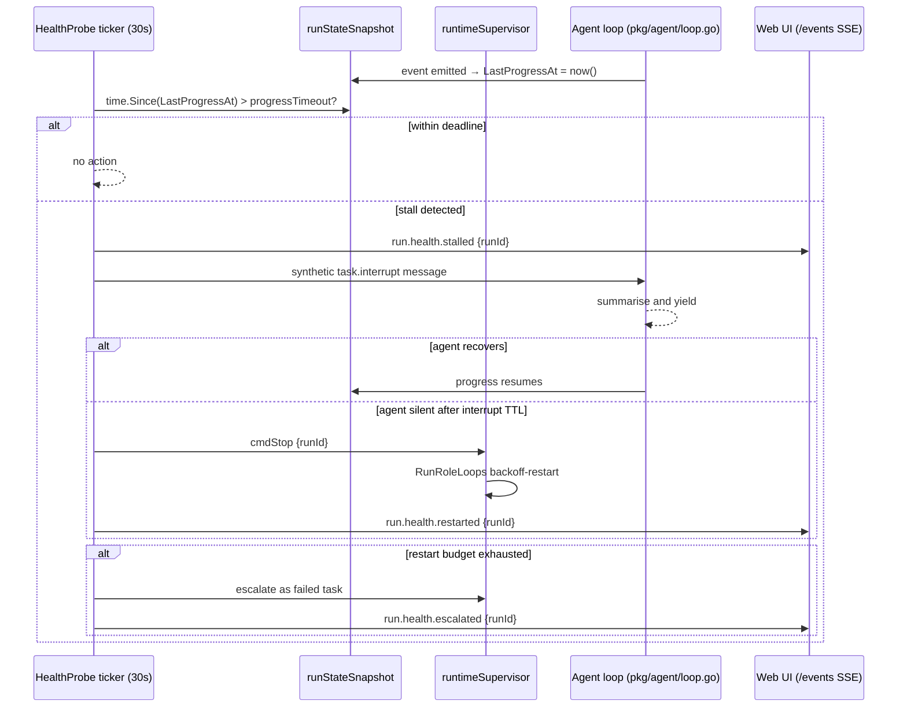
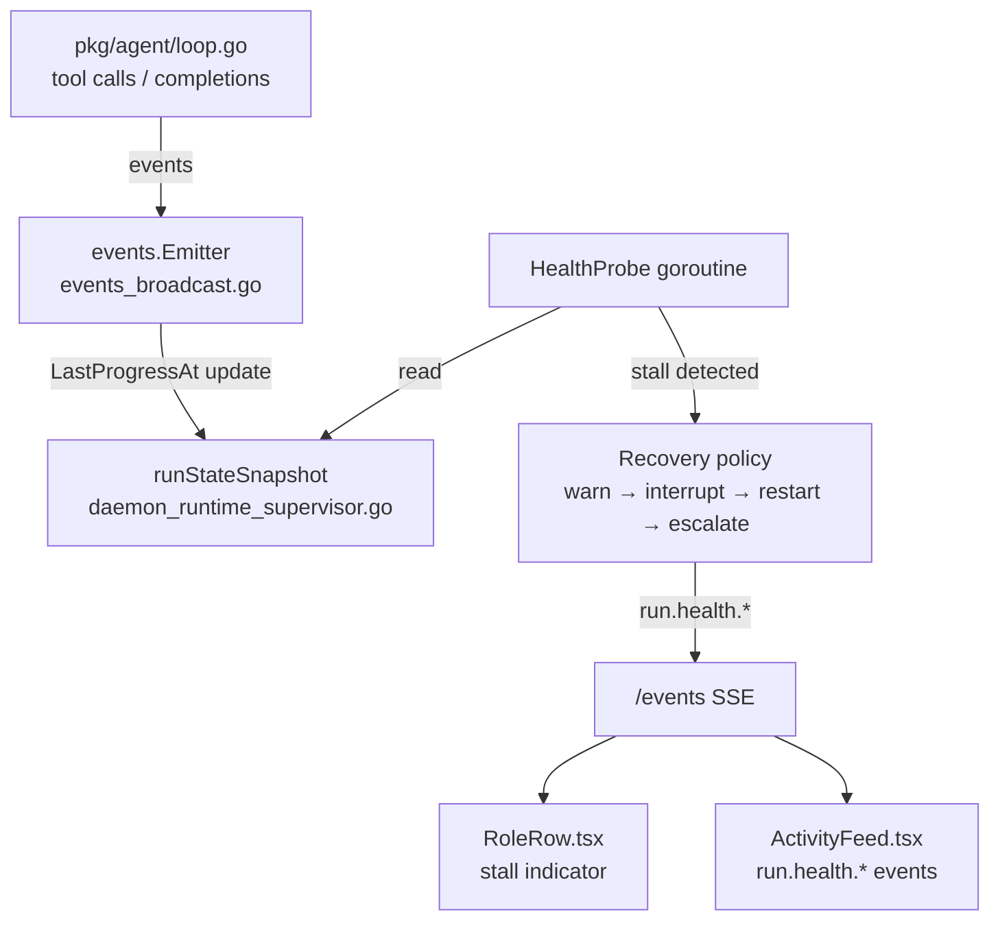

# Issue: Agent health probes and self-healing

## Summary

The runtime currently has no way to detect that an agent is stuck, looping, or silently failing. When an agent stops making progress it either runs until a token budget is exhausted or sits indefinitely — requiring the operator to notice and intervene. This issue tracks adding liveness and progress probes that enable the daemon to detect and recover from unhealthy agents automatically.

## Problem

- An agent stuck in a reasoning loop consumes tokens indefinitely with no external signal.
- An agent waiting on a tool response that will never arrive (e.g. a hung subprocess) blocks its run slot.
- The operator must watch the web UI or logs to notice a stalled agent. There is no automatic escalation.
- Scheduled heartbeat jobs (`profile.HeartbeatJob`) exist per profile for proactive work, but there is no equivalent probe for the *liveness* of an active run.

## What already exists

| Component | Location | Relevance |
|---|---|---|
| `repeatedInvalidToolCallThreshold = 6` | `pkg/agent/loop.go` | Caps invalid tool call loops — closest existing error-threshold probe |
| `textOnlyNudgeThreshold = 3` | `pkg/agent/loop.go` | Caps text-without-tool-call loops before returning `ErrTextOnlyCompletion` |
| `startHeartbeats` / `handleHeartbeat` | `pkg/agent/session/session.go` | Tick-based job scheduling infrastructure; model for a progress ticker |
| `RunRoleLoops` backoff-restart | `pkg/services/team/run_loop.go` | Already restarts a crashed runner with exponential backoff — scaffold for structured restart |
| `runHandle.state` (`handleStateDraining`) | `internal/app/daemon_runtime_supervisor.go` | `handleStateDraining` exists; "stalling" is a new state to add alongside it |
| `runStateSnapshot` | `internal/app/daemon_runtime_supervisor.go` | Snapshots `PersistedStatus`, `WorkerPresent`, `Model`; extend with `LastProgressAt` |
| `events.Emitter` | `pkg/agent/session/session.go` → `internal/app/events_broadcast.go` | All events reach the browser via the `/events` SSE path |
| `run.health.*` types | (absent) | New event types to add |

The existing loop-level error thresholds (`repeatedInvalidToolCallThreshold`, `textOnlyNudgeThreshold`) catch some bad-state loops at the agent level, but they do not cover: (a) silence (no tool calls at all), (b) hung tool execution, or (c) slow drain where the loop continues but makes no meaningful progress.

## Proposed approach

### 1. Progress probe config

Per-profile (in `profile.yaml`) or project-wide (in `agen8.yaml`), all keys camelCase:

```yaml
health:
  progressTimeout: 5m        # max silence before stall declared
  maxConsecutiveErrors: 3    # LLM or tool errors before recovery starts
  recoveryPolicy:
    - warn
    - interrupt
    - restart
    - escalate
```

### 2. `LastProgressAt` on `runStateSnapshot`

In `daemon_runtime_supervisor.go`, extend `runStateSnapshot` with a `LastProgressAt time.Time` field. The supervisor updates this field any time the run emits an event (already routed through `events_broadcast.go`). The probe reads this field, not the agent's internal state, so there is no coupling into the loop.

### 3. Progress probe goroutine

A probe goroutine runs alongside the supervisor's main loop. On each tick (e.g. every 30 s) it iterates `snapshots` and checks `time.Since(LastProgressAt) > progressTimeout` for each running handle.



### 4. Error threshold probe

The supervisor listens for `run.error` events (already emitted by `session.go` on LLM/tool failures). A per-run counter increments on each error and resets on successful tool completion. When `maxConsecutiveErrors` is exceeded the recovery policy starts at the **interrupt** step (skipping warn, since an error is already visible).

### 5. Recovery policy

Steps applied in order; any step that resolves the stall stops the sequence.

| Step | What happens | Where implemented |
|---|---|---|
| `warn` | Emit `run.health.stalled`; badge in web UI | `events_broadcast.go` |
| `interrupt` | Inject synthetic `task.interrupt` into the session's inbox via `MessageBus` | `pkg/agent/session/session.go` — `drainInbox` already handles task kinds |
| `restart` | `cmdStop` + `RunRoleLoops` restarts with backoff; re-queue the active task | `daemon_runtime_supervisor.go`, `run_loop.go` |
| `escalate` | Mark task failed; deliver escalation callback to coordinator/parent | `pkg/services/task/manager.go` |

### 6. Web UI surface

- **`RoleRow`** (`web/src/components/RoleRow.tsx`): add a stall indicator (amber pulse dot, distinct from the green `PulseDot` used for active runs).
- **`ActivityFeed`** (`web/src/components/ActivityFeed.tsx`): surface `run.health.*` events with a dedicated icon/style.
- `run.health.*` events arrive via the existing `/events` SSE path — no new transport needed.



## Acceptance criteria

- [ ] A run that emits no event within `progressTimeout` is marked stalled.
- [ ] Recovery policy steps are applied in configured order; any step that resolves the stall stops the sequence.
- [ ] An interrupted run receives a synthetic `task.interrupt` before being forcibly stopped.
- [ ] Restart respects `RunRoleLoops` backoff and the team's escalation path.
- [ ] `maxConsecutiveErrors` threshold triggers recovery starting at the interrupt step.
- [ ] `run.health.*` events appear in the web UI activity feed.
- [ ] Stalled `RoleRow` has a distinct visual indicator from active/paused.
- [ ] All config keys in `profile.yaml` and `agen8.yaml` are camelCase.

## Key files to change

| File | Change |
|---|---|
| `internal/app/daemon_runtime_supervisor.go` | Add `LastProgressAt` to `runStateSnapshot`; add health probe goroutine; implement recovery steps |
| `pkg/agent/session/session.go` | Emit `LastProgressAt` update on each event; handle `task.interrupt` kind in `drainInbox` |
| `pkg/services/team/run_loop.go` | Expose restart count so probe can detect budget exhaustion |
| `pkg/profile/` | Parse `health.*` config from profile YAML |
| `web/src/components/RoleRow.tsx` | Add stall indicator |
| `web/src/components/ActivityFeed.tsx` | Style `run.health.*` events |

## Related

- `pkg/agent/loop.go` — existing `repeatedInvalidToolCallThreshold` / `textOnlyNudgeThreshold` operate inside the loop; this probe operates from outside (supervisor level)
- `docs/issues/desired-state-reconciliation.md` — reconciler restarts crashed teams; health probe handles *stuck* (not crashed) runs
- `docs/issues/declarative-profile-rollouts.md` — canary health window reuses the same probe signal
