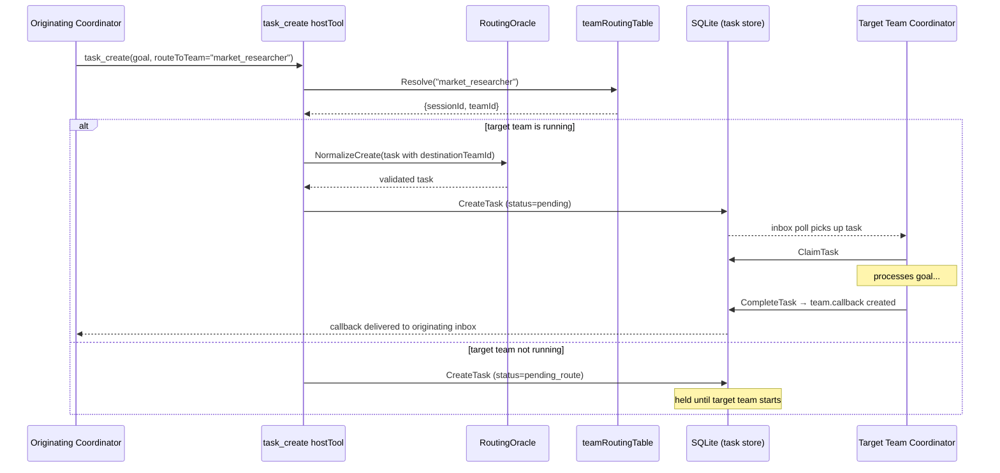
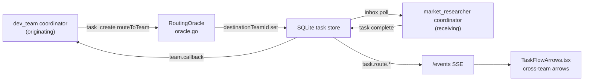

# Issue: Cross-team task routing

## Summary

Tasks today are scoped to a single team. There is no mechanism for one team to send work to another team within the same project — if `dev_team` needs market research, a human must relay that manually. This issue tracks a cross-team routing primitive that lets teams delegate work to each other.

## Problem

- The execution model explicitly forbids lateral communication between agents within a team (no sibling-to-sibling messaging). This is correct for intra-team hygiene.
- But there is no sanctioned path for *inter-team* work handoffs at the project level either.
- Teams that naturally produce outputs another team consumes (e.g. market research feeding product decisions) require manual operator intervention to connect.

## What already exists

This feature is remarkably close to buildable from what exists today:

| Component | Location | Relevance |
|---|---|---|
| `SourceTeamID` / `DestinationTeamID` on `Task` | `pkg/protocol/task.go`, `pkg/agent/state/sqlite_task_store.go` | Cross-team routing fields are already defined in the protocol and persisted to SQLite |
| `RoutingOracle` | `pkg/services/task/oracle.go` | Already normalises `destinationTeamId`, validates `assignedToType` (`agent`/`role`/`team`) and emits routing metadata |
| `team.callback` / `team.batch.callback` sources | `pkg/agent/session/session.go` — `taskSourceTeamCallback` | Callback path from a destination team back to the originating coordinator already exists conceptually |
| `task_create` host tool | `pkg/agent/hosttools/task_create.go` | Supports `assignedRole` with team-scoped routing; `TeamID` is already set on the task |
| `isCallbackSource` | `pkg/services/task/oracle.go` | Identifies callback tasks and resolves `destinationTeamId` from the run's `Runtime.TeamID` |
| `ProjectTeamService` | `internal/app/project_team_service.go` | Can resolve a profile/team name to an active session ID — the routing table base |
| `TaskListParams.Scope` | `pkg/protocol/task.go` | `scope: "team"` already accepted; `scope: "project"` would be a natural addition |

The `RoutingOracle` already routes tasks to `destinationTeamId` when set. The missing pieces are: (1) exposing `routeToTeam` on `task_create` so a coordinator can target another team by name, (2) a project-level routing table to resolve team name → active session, and (3) a hold-and-deliver mechanism for tasks routed to teams not yet running.

## Proposed approach

### 1. Extend `task_create` with `routeToTeam`

Add `routeToTeam` to `TaskCreateTool` in `pkg/agent/hosttools/task_create.go`:

```
task_create(
  goal: "Research competitor pricing for Q2",
  routeToTeam: "market_researcher"
)
```

When `routeToTeam` is set, the tool:
1. Looks up the target team's active session via the project routing table.
2. Sets `destinationTeamId` and `assignedToType: "team"` on the task.
3. The `RoutingOracle` (already wired in `pkg/services/task/manager.go`) validates and canonicalises the routing.
4. Creates the task in the SQLite task store — the target team's session loop will claim it from its inbox on the next poll.

### 2. Project routing table

The daemon maintains a `teamRoutingTable`: profile name → active `{sessionID, teamID}`. This is a thin wrapper around `ProjectTeamService.ListByProject` (already exists in `internal/app/project_team_service.go`) combined with the in-memory `runHandle` map in `runtimeSupervisor`.



### 3. Hold-and-deliver for offline teams

Tasks with `status: pending_route` are held in the task store. When the reconciler starts a team (see `desired-state-reconciliation.md`), it triggers a routing sweep: pending-route tasks whose `destinationTeamId` matches the newly started team are transitioned to `pending` so the team's session loop can pick them up.

### 4. Authority and trust model

Cross-team routing is peer-to-peer at the coordinator level — a coordinator can request work from another team's coordinator but cannot issue commands into that team's internal hierarchy. The `RoutingOracle` enforces this: `assignedToType: "team"` routes to the coordinator's inbox, not to a specific sub-role. The receiving coordinator decides how to handle the task and may decline or defer it. This is identical to how `assignedRole` is validated today for intra-team tasks.

### 5. Web UI surface

- **Task flow diagram** (`web/src/components/TaskFlowArrows.tsx`): extend to render cross-team arrows between `TeamCard` components.
- **Task list** in the web UI: extend the `task.list` RPC scope filter to support `scope: "project"` for a project-wide view. The `Task` type in `web/src/lib/types.ts` already has `sourceTeamId` and `destinationTeamId` fields.



## Acceptance criteria

- [ ] A coordinator can call `task_create` with `routeToTeam` naming another profile in the same project.
- [ ] The task is delivered to the target team's coordinator inbox.
- [ ] A `team.callback` is delivered to the originating coordinator when the task completes.
- [ ] Tasks routed to a team that is not running are held as `pending_route` and delivered when the team starts.
- [ ] The receiving coordinator retains full authority; `routeToTeam` only reaches the coordinator inbox, not sub-roles.
- [ ] `task.list` with `scope: "project"` surfaces cross-team tasks with their routing state.
- [ ] `task.route.*` events appear in the web UI activity feed.
- [ ] `TaskFlowArrows` renders cross-team arrows between TeamCard components in the web UI.

## Key files to change

| File | Change |
|---|---|
| `pkg/agent/hosttools/task_create.go` | Add `routeToTeam` param; resolve via routing table; set `destinationTeamId` |
| `pkg/agent/hosttools/task_create_test.go` | Add cross-team routing tests |
| `pkg/services/task/oracle.go` | Accept `assignedToType: "team"` as a valid routed task (may already work) |
| `pkg/services/task/manager.go` | Add `pending_route` status handling; routing sweep on team start |
| `internal/app/daemon_runtime_supervisor.go` | Expose routing table; trigger routing sweep on `cmdSpawn` completion |
| `internal/app/rpc_session.go` or `rpc_team.go` | Add `scope: "project"` to task list handler |
| `web/src/components/TaskFlowArrows.tsx` | Render cross-team arrows |
| `web/src/lib/types.ts` | Ensure `Task.sourceTeamId` / `destinationTeamId` are surfaced in list views |

## Related

- `pkg/services/task/oracle.go` — `RoutingOracle` already handles `destinationTeamId`; cross-team routing extends it minimally
- `docs/issues/desired-state-reconciliation.md` — routing table and routing sweep depend on the reconciler knowing which teams are running
