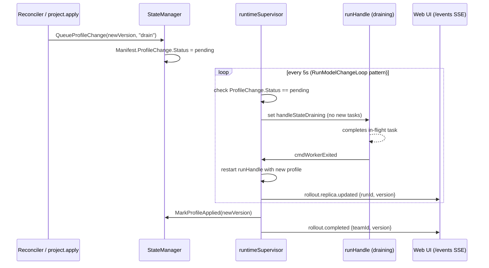
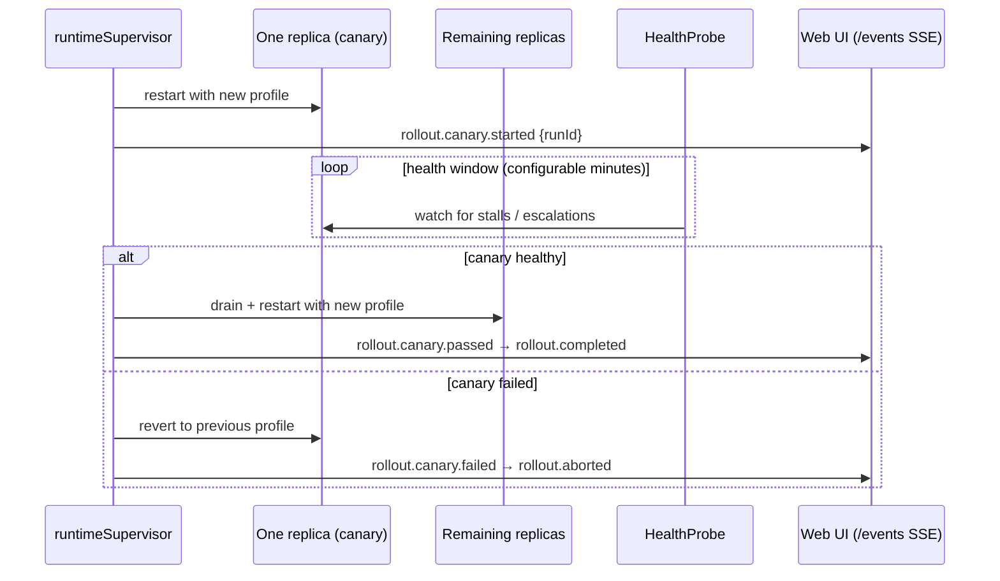
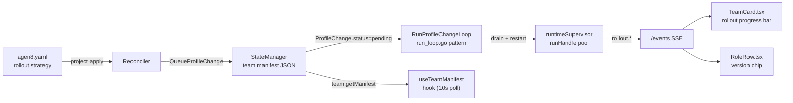

# Issue: Declarative profile rollouts

## Summary

Updating a running team today requires a full stop and restart — there is no way to roll out a profile change (new model, updated system prompt, added skill) while the team continues processing work. This issue tracks a rollout mechanism that applies profile updates gracefully, draining in-flight work before swapping the configuration.

## Problem

- `team start <profile>` is all-or-nothing. A profile change means stopping the team, losing in-flight context, and restarting cold.
- Operators cannot test a profile change on one co-agent while the rest of the team runs the previous version.
- There is no audit trail of which profile version was running when a specific run was executed.

## What already exists

| Component | Location | Relevance |
|---|---|---|
| `ModelChange` on `Manifest` | `pkg/services/team/types.go` | `pending → applied → failed` pattern for model changes is a direct template for profile rollout state |
| `RunModelChangeLoop` | `pkg/services/team/run_loop.go` | Polls for `pending` model changes and applies them when `IsTeamIdle`; same pattern applies to profile version changes |
| `handleStateDraining` | `internal/app/daemon_runtime_supervisor.go` | State already exists on `runHandle`; drain strategy reuses it |
| `DesiredReplicasByRole` | `pkg/services/team/types.go` — `Manifest` | Per-role replica counts; canary modifies one replica's profile while others hold |
| `StateManager.QueueModelChange` | `pkg/services/team/state.go` | Atomic manifest mutation with persistence; model for `QueueProfileChange` |
| Profile content hash | absent — needs adding | BLAKE2 or SHA-256 of the resolved profile YAML gives a stable version without an explicit `version` field |
| `Run` store | `internal/store/run.go` | Existing `Run` record; add `ProfileVersion string` column to record which profile version produced a run |
| `team.getManifest` RPC | `internal/app/rpc_team.go` | Already returns `teamModel`, `modelChange`; extend to include `profileVersion`, `rollout` |
| `useTeamManifest` hook | `web/src/hooks/useTeamStatus.ts` | Polls `team.getManifest` every 10 s; rollout progress fields surface here automatically |

## Proposed approach

### 1. Profile versioning

Profiles gain a `version` field in `profile.yaml` (optional). When absent, the daemon derives a version from a content hash of the resolved profile (after role refs are merged). The daemon records `profileVersion` on each `Run` record at start time.

### 2. Rollout strategy in `agen8.yaml`

```yaml
teams:
  - profile: dev_team
    rollout:
      strategy: drain       # wait for in-flight runs, then swap
      # strategy: immediate # terminate and restart immediately
      # strategy: canary    # one replica first, gate on health window
      canary:
        healthWindowMinutes: 10
```

### 3. `ProfileChange` on the team `Manifest`

Mirror `ModelChange` with a `ProfileChange` struct:

```go
type ProfileChange struct {
    RequestedVersion string // content hash or explicit version
    Status           string // pending|draining|applied|failed
    Strategy         string // drain|immediate|canary
    CanaryRunID      string // set during canary phase
    RequestedAt      string
    AppliedAt        string
    Error            string
}
```

Persisted to the team manifest JSON file via `StateManager` (same pattern as `MarkModelApplied`/`MarkModelFailed`).

### 4. Rollout flows

#### `drain` strategy



#### `canary` strategy



### 5. Web UI surface

The rollout state is already surfaced via `team.getManifest` (polled by `useTeamManifest` every 10 s). Extend the response with:

```json
{
  "profileVersion": "abc123",
  "profileChange": {
    "requestedVersion": "def456",
    "status": "draining",
    "strategy": "drain",
    "replicasUpdated": 1,
    "replicasTotal": 3
  }
}
```

- **`TeamCard`** (`web/src/components/TeamCard.tsx`): add a rollout progress bar (`replicasUpdated / replicasTotal`) when `profileChange.status` is not `applied`.
- **`RoleRow`** (`web/src/components/RoleRow.tsx`): show a version chip (`v1` → `v2`) when a replica is on a different version.
- `rollout.*` events broadcast via `/events` SSE update the UI in real time between manifest polls.



## Acceptance criteria

- [ ] `profileVersion` is derived (content hash) or explicit and recorded on every `Run` at start time.
- [ ] `drain` strategy marks replicas as `handleStateDraining`; they complete in-flight tasks before restart.
- [ ] `immediate` strategy stops and restarts replicas without waiting.
- [ ] `canary` strategy applies the update to one replica first and gates the rest on the configured health window.
- [ ] A failed canary aborts the rollout and reverts the canary replica to the previous profile.
- [ ] `team.getManifest` returns `profileVersion` and `profileChange` with rollout progress.
- [ ] `TeamCard` shows a rollout progress bar during active rollouts.
- [ ] `RoleRow` shows a version chip when a replica is on a different profile version.
- [ ] `rollout.*` events appear in the web UI activity feed.
- [ ] All `agen8.yaml` keys are camelCase.

## Key files to change

| File | Change |
|---|---|
| `pkg/services/team/types.go` | Add `ProfileChange` struct to `Manifest` |
| `pkg/services/team/state.go` | Add `QueueProfileChange`, `MarkProfileApplied`, `MarkProfileFailed` |
| `pkg/services/team/run_loop.go` | Add `RunProfileChangeLoop` (mirrors `RunModelChangeLoop`) |
| `internal/app/daemon_runtime_supervisor.go` | Act on `ProfileChange.Status`; implement drain/immediate/canary flows |
| `internal/store/run.go` | Add `ProfileVersion string` column to run records |
| `pkg/protocol/rpc_parity.go` | Add `profileVersion`, `profileChange` to `TeamGetManifestResult` |
| `web/src/lib/types.ts` | Extend `TeamGetManifestResult` with rollout fields |
| `web/src/components/TeamCard.tsx` | Add rollout progress bar |
| `web/src/components/RoleRow.tsx` | Add version chip |

## Related

- `pkg/services/team/run_loop.go` — `RunModelChangeLoop` is the direct template for `RunProfileChangeLoop`
- `docs/issues/desired-state-reconciliation.md` — reconciler detects version drift and triggers rollouts via `project.apply`
- `docs/issues/agent-health-probes.md` — canary health window uses the same `run.health.*` probe signal
- `defaults/profiles/` — profile definitions that will gain content-hash versioning
