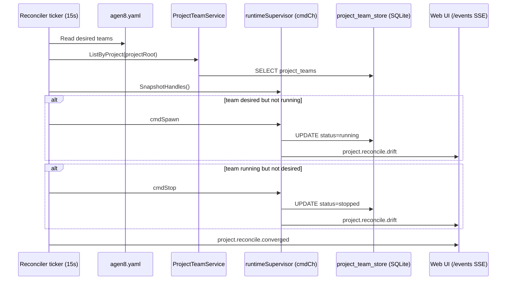
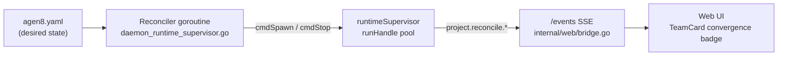

# Issue: Desired state reconciliation for projects

## Summary

Today a project is activated imperatively — `agen8 team start <profile>` boots a team and it runs until stopped. There is no persistent record of what *should* be running, so restarts are manual and drift between intended and actual state is invisible.

This issue tracks adding a project-level desired state manifest and a reconciler that continuously enforces it.

## Problem

- `team start` is a one-shot imperative command. If the daemon restarts or a team exits unexpectedly, nothing brings it back.
- There is no way to declare "this project should always have a `dev_team` running" and have the runtime uphold that contract.
- Operators must manually detect and recover from team failures.
- `ProjectTeamService` (`internal/app/project_team_service.go`) and `ProjectTeamRecord` (`internal/store/project_team_store.go`) already track which teams belong to a project, but nothing acts on that data to enforce liveness.

## What already exists

| Component | Location | Relevance |
|---|---|---|
| `ProjectTeamService` | `internal/app/project_team_service.go` | Registers/unregisters teams per project; stores `status` field |
| `ProjectTeamRecord` store | `internal/store/project_team_store.go` | SQLite persistence for project↔team mapping |
| `runtimeSupervisor` | `internal/app/daemon_runtime_supervisor.go` | Manages `runHandle` lifecycle; has `cmdSpawn`/`cmdStop` supervisor commands on `cmdCh` |
| `RunRoleLoops` | `pkg/services/team/run_loop.go` | Backoff-restart for individual role loops — model for reconciler retry logic |
| `project.listTeams` RPC | called by `useProjectTeams` in `web/src/hooks/useProjectTeams.ts` | Already polled every 2 s in the web UI |
| SSE event stream | `internal/web/bridge.go` → `/events` | Broadcasts `NotifyEventAppend` to all connected browser clients |

## Proposed approach

### 1. Project manifest (`agen8.yaml`)

Add an `agen8.yaml` at the project root (or `.agen8/`) declaring desired running state. Keys are camelCase to match the existing JSON/RPC convention used throughout the protocol layer:

```yaml
projectId: my-app

teams:
  - profile: dev_team
    enabled: true
  - profile: market_researcher
    enabled: true
    heartbeat:
      overrideInterval: 30m
```

`agen8 project init` writes an initial manifest. `agen8 project status` diffs desired vs actual.

### 2. Reconciler loop

The reconciler runs as a goroutine inside `runtimeSupervisor.Run` (`internal/app/daemon_runtime_supervisor.go`) on a configurable tick (default 15 s). It reuses the existing `cmdCh` channel to issue `cmdSpawn`/`cmdStop` commands — the supervisor already processes these atomically.

On each tick:
1. Read `agen8.yaml` from disk.
2. Load `ProjectTeamRecord`s via `ProjectTeamService.ListByProject`.
3. Snapshot current `runHandle` states from `runtimeSupervisor`.
4. For each desired team not running → send `cmdSpawn`.
5. For each running team absent from the manifest (or `enabled: false`) → send `cmdStop`.
6. Emit events via the existing `events.Emitter`; they reach the browser via the `/events` SSE path.



### 3. New RPC methods

| Method | Params | Behaviour |
|---|---|---|
| `project.apply` | `{ projectRoot }` | Immediate reconciliation pass; returns diff |
| `project.diff` | `{ projectRoot }` | Read-only drift report (desired vs actual) |

These are registered alongside existing handlers in `internal/app/rpc_team.go`.

### 4. Web UI surface

- **Overview panel** (`web/src/components/TeamCard.tsx`): add a convergence badge (`converged` / `drifting` / `reconciling`) driven by `project.reconcile.*` events received via the `/events` SSE connection in `web/src/lib/rpc.ts`.
- `useProjectTeams` in `web/src/hooks/useProjectTeams.ts` already polls `project.listTeams` every 2 s — extend it to subscribe to `project.reconcile.*` notifications so the badge updates without waiting for the next poll.



## Acceptance criteria

- [ ] `agen8.yaml` is parsed on daemon startup and on each reconciler tick (15 s default, configurable).
- [ ] A team listed as `enabled: true` is automatically (re)started if not running.
- [ ] A team removed from the manifest or set `enabled: false` is stopped gracefully via `cmdStop`.
- [ ] `project.diff` returns a structured drift report without side effects.
- [ ] `project.apply` triggers an immediate reconciliation and returns the resulting diff.
- [ ] `project.reconcile.*` events appear in the web UI activity feed.
- [ ] Daemon restart with an existing manifest converges to desired state without manual intervention.
- [ ] All `agen8.yaml` keys are camelCase.

## Key files to change

| File | Change |
|---|---|
| `internal/app/daemon_runtime_supervisor.go` | Add reconciler goroutine; expose `SnapshotHandles()` |
| `internal/app/project_team_service.go` | Add `ListByProject`, `SetStatus` for reconciler use |
| `internal/app/rpc_team.go` | Register `project.apply` and `project.diff` handlers |
| `internal/app/team_daemon.go` | Wire reconciler into `runAsTeamInternal` startup |
| `web/src/components/TeamCard.tsx` | Add convergence badge |
| `web/src/hooks/useProjectTeams.ts` | Subscribe to `project.reconcile.*` SSE notifications |
