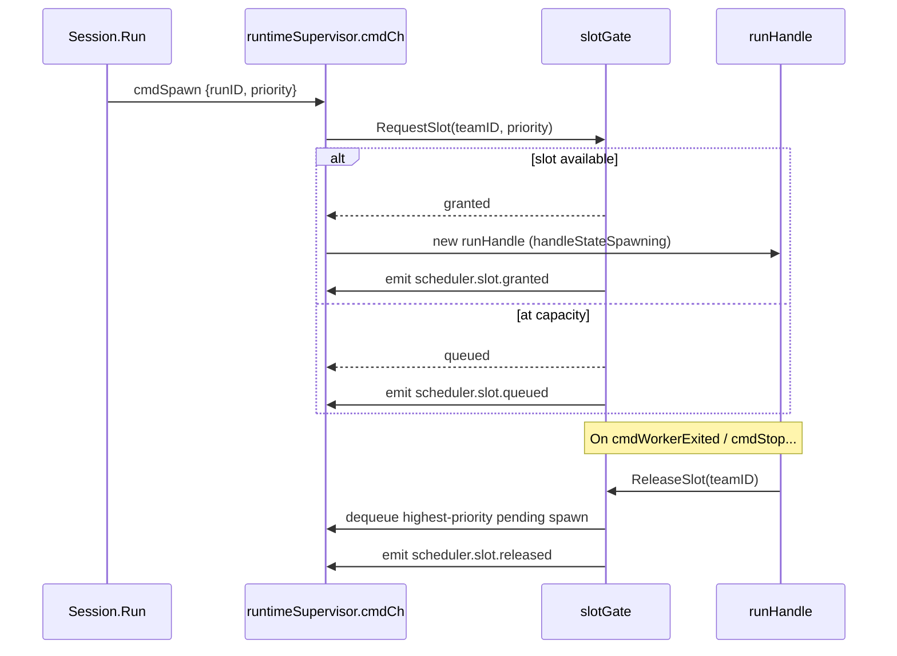
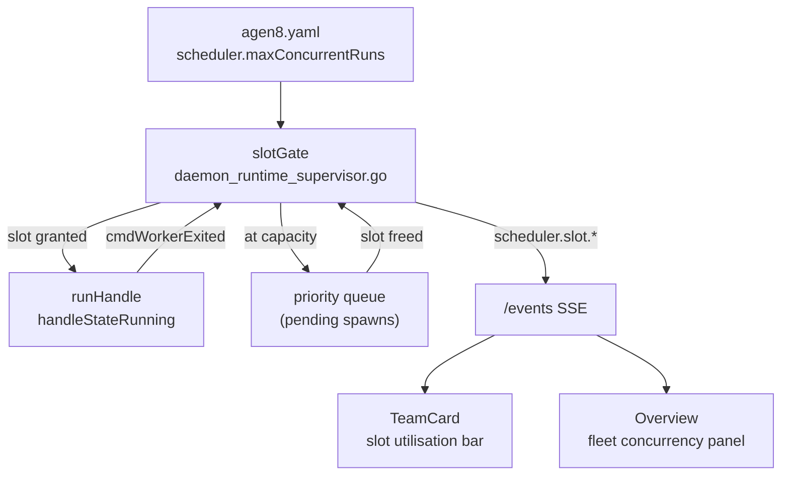

# Issue: Multi-team scheduling within a project

## Summary

A project can run multiple teams today, but the runtime has no concept of scheduling across them — there are no shared resource limits, no concurrency controls, and no way to prioritise one team's work over another's. This issue tracks adding a scheduler that manages multiple running teams as a single fleet.

## Problem

- Starting multiple teams is additive and uncontrolled. Each team consumes model calls independently with no ceiling.
- There is no way to say "run at most 6 co-agents concurrently across all teams" or "dev_team gets priority over market_researcher."
- The `runtimeSupervisor` in `internal/app/daemon_runtime_supervisor.go` spawns runs via `cmdSpawn` with no slot awareness — it just adds a new `runHandle` unconditionally.
- The operator has no single view of load across teams; `team.getStatus` is per-team only.

## What already exists

| Component | Location | Relevance |
|---|---|---|
| `runtimeSupervisor.cmdCh` | `internal/app/daemon_runtime_supervisor.go` | All spawn/stop commands flow through here — natural interception point for a slot gate |
| `runHandle` + `handleState` | `internal/app/daemon_runtime_supervisor.go` | Tracks `handleStateSpawning`, `handleStateRunning`, `handleStatePaused`, `handleStateDraining` |
| `DesiredReplicasByRole` | `pkg/services/team/types.go` — `Manifest` struct | Per-role replica count already exists; scheduler can enforce it as a ceiling |
| `messageScheduler` interface | `pkg/services/task/manager.go` | Atomic `ClaimNextMessage` already serialises task pickup; scheduler can add a concurrency layer above this |
| `team.getStatus` RPC | `internal/app/rpc_team.go` | Returns `pending`, `active`, `done` counts — data the scheduler already has access to |
| `useTeamStatus` hook | `web/src/hooks/useTeamStatus.ts` | Polls `team.getStatus` every 1.5 s for per-team load display in `TeamCard` |

## Proposed approach

### 1. Project-level resource limits in `agen8.yaml`

```yaml
scheduler:
  maxConcurrentRuns: 6      # across all teams in this project
  maxConcurrentPerTeam: 3   # per-team ceiling

teams:
  - profile: dev_team
    priority: high
  - profile: market_researcher
    priority: low
```

### 2. Slot gate in the runtime supervisor

A `slotGate` sits in front of `cmdSpawn` processing inside `runtimeSupervisor.Run`. When the supervisor receives `cmdSpawn` it asks the gate for a slot before creating the `runHandle`.

- The gate counts active `runHandle`s across all teams (from the existing `handles` map) against `maxConcurrentRuns`.
- Per-team count is checked against `maxConcurrentPerTeam`.
- When no slot is available, the command is placed in a priority queue ordered by the team's declared priority.
- When a `cmdWorkerExited` or `cmdStop` frees a slot, the gate dequeues the highest-priority pending spawn and re-issues it.



### 3. New RPC fields

Extend `team.getStatus` response (already defined in `internal/app/rpc_team.go`) with scheduler fields:

```json
{
  "slotsUsed": 4,
  "slotsTotal": 6,
  "slotsQueued": 1,
  "teamSlotsUsed": 2,
  "teamSlotsTotal": 3
}
```

Add a `project.getSchedulerState` method returning fleet-wide slot utilisation across all teams.

### 4. Web UI surface

- **`TeamCard`** (`web/src/components/TeamCard.tsx`): add a slot utilisation bar using `slotsUsed`/`slotsTotal` from the extended `team.getStatus` response.
- **Overview page**: add a fleet-wide concurrency panel pulling from `project.getSchedulerState`.
- Events `scheduler.slot.granted`, `scheduler.slot.queued`, `scheduler.slot.released` are broadcast via the `/events` SSE path and shown in the activity feed.



## Acceptance criteria

- [ ] `maxConcurrentRuns` is enforced across all teams in a project.
- [ ] `maxConcurrentPerTeam` is enforced per team independently.
- [ ] Spawns that cannot start immediately are queued and start as slots free up.
- [ ] Priority ordering is respected when multiple queued spawns compete for a slot.
- [ ] `team.getStatus` response includes `slotsUsed`, `slotsTotal`, `slotsQueued`.
- [ ] `project.getSchedulerState` returns fleet-wide utilisation.
- [ ] `scheduler.slot.*` events appear in the web UI activity feed.
- [ ] All `agen8.yaml` keys are camelCase.

## Key files to change

| File | Change |
|---|---|
| `internal/app/daemon_runtime_supervisor.go` | Add `slotGate`; gate `cmdSpawn` processing; emit `scheduler.slot.*` events |
| `internal/app/rpc_team.go` | Extend `team.getStatus` with slot fields; add `project.getSchedulerState` |
| `pkg/protocol/rpc_parity.go` | Add slot fields to `TeamGetStatusResult` |
| `web/src/components/TeamCard.tsx` | Add slot utilisation bar |
| `web/src/lib/types.ts` | Extend `TeamGetStatusResult` with slot fields |

## Related

- `docs/issues/desired-state-reconciliation.md` — reconciler feeds `cmdSpawn` commands that the scheduler will gate
- `pkg/services/team/types.go` — `DesiredReplicasByRole` as a ceiling input to the scheduler
