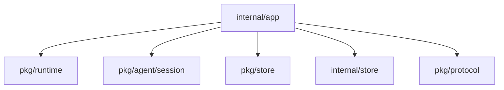
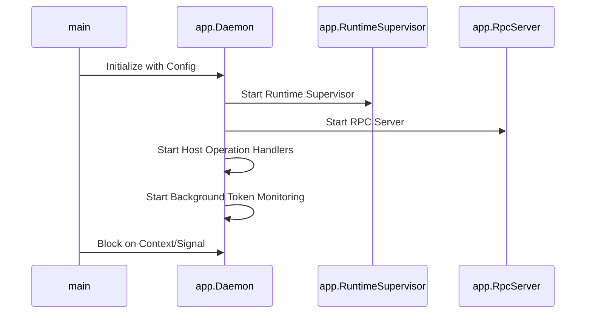
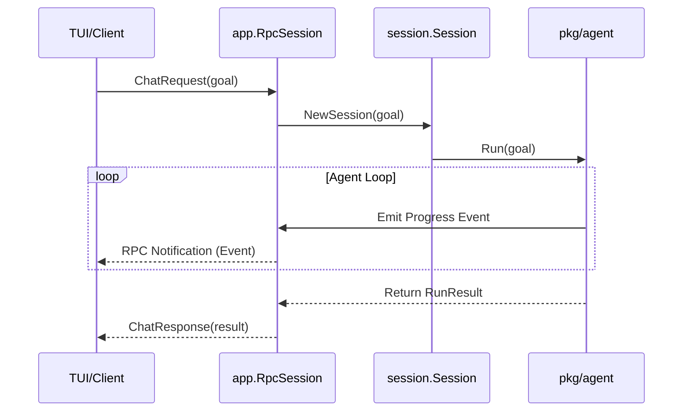

# Package: internal/app

## Purpose
The `app` package is the operational brain of the workbench. it provides the daemon implementation, RPC server, and session management logic. It is responsible for bootstrapping the entire system, initializing storage, managing the runtime supervisor for active runs, and serving as the interface for both the Terminal User Interface (TUI) and headless background workers.

## Exported Types/Functions
- `RunDaemon`: Starts the autonomous worker loop for polling and executing tasks.
- `RuntimeSupervisor`: Manages the lifecycle and resource isolation of active agent runtimes.
- `RpcServer`: Implements the JSON-RPC interface for remote control and monitoring.
- `RpcSession`: Handles session-specific RPC requests (chat, tool calls, events).
- `Daemon`: The central struct coordinating the supervisor, RPC server, and background workers.

## Package Dependencies

## Daemon Bootstrapping Sequence

## Runtime Flow: RPC Session Chat

## Invariants
- The `RuntimeSupervisor` is the single source of truth for all active runtimes; it must prevent resource leaks by ensuring proper shutdown of unused environments.
- RPC sessions must be isolated; a client should only be able to interact with runs/tasks they are authorized for (context-based).
- The daemon must be resilient to LLM availability; it should implement retries and graceful degradation where possible.
- Application-level bootstrapping (seeding defaults, initializing store) must compete before the RPC server becomes available.
