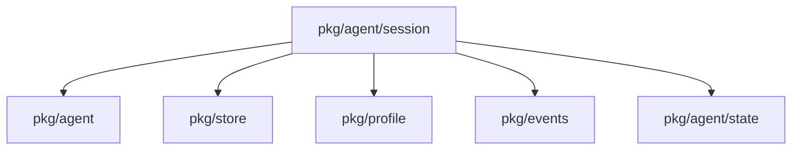
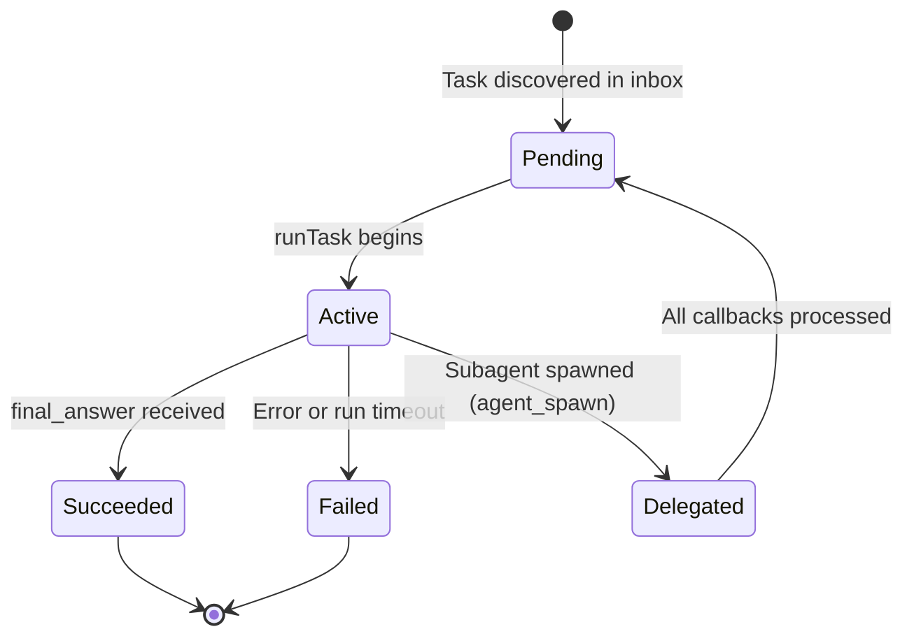
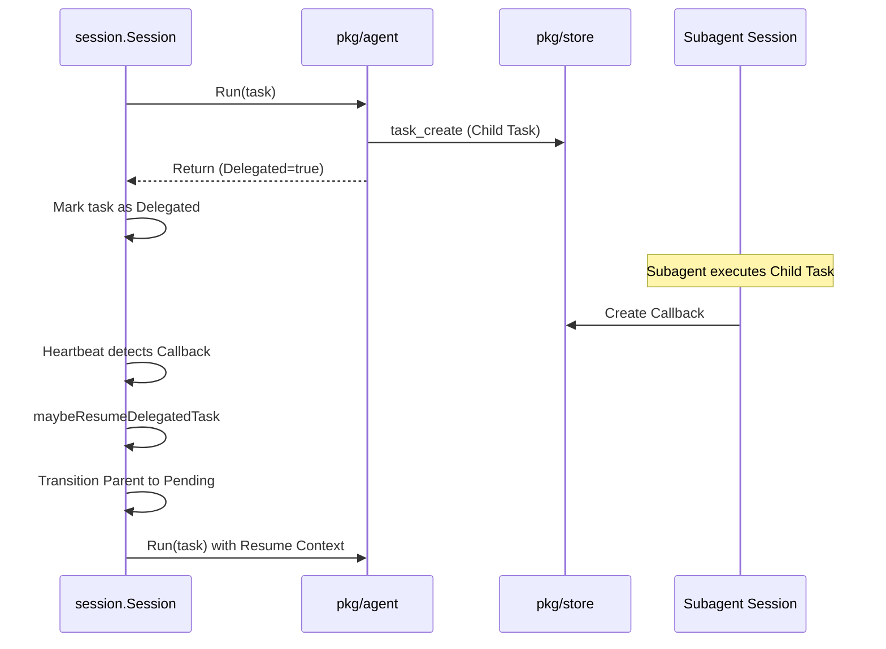

# Package: pkg/agent/session

## Purpose
The `session` package is the orchestrator for task execution and lifecycle management. It manages an "inbox" of tasks, handling their progression from discovery to completion. It bridges the gap between the stateless `agent` loop and the persistent `store`, ensuring that subagent delegations are correctly tracked and resumed through heartbeats and callback processing.

## Exported Types/Functions
- `Session`: The main coordinator struct for task execution.
- `New(cfg Config)`: Initializes a new session with agent, store, and profile configuration.
- `Session.Run(ctx context.Context)`: The entry point for processing the session's task inbox.
- `Session.SetPaused(paused bool)`: Controls the execution state of the session.
- `Config`: Configuration struct for session behavior, including delegation roles.

## Package Dependencies

## Task State Machine

## Runtime Flow: Subagent Delegation

## Invariants
- A task in the `Delegated` state must not be processed by the parent agent until all its child callbacks are resolved.
- Session heartbeats are the primary mechanism for detecting changes in the external task store (e.g., child completions).
- The session must ensure that the VFS state and LLM history are correctly persisted to allow for task resumption.
