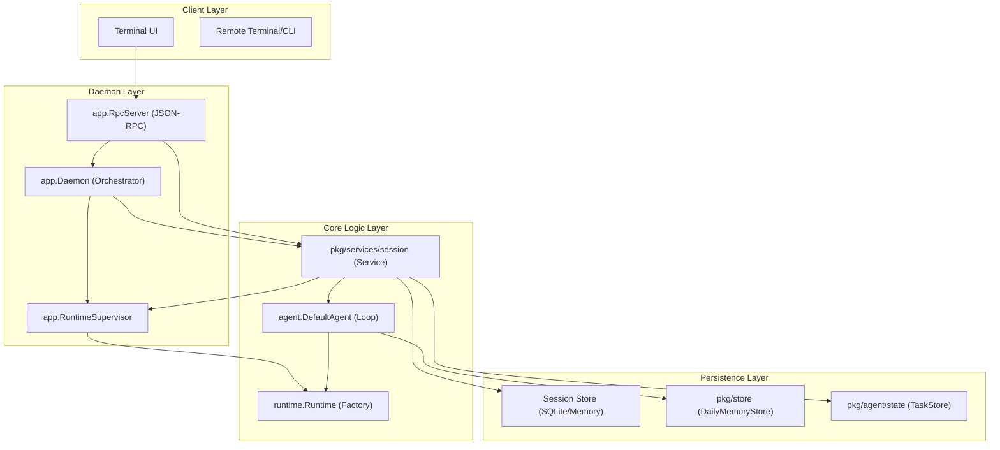
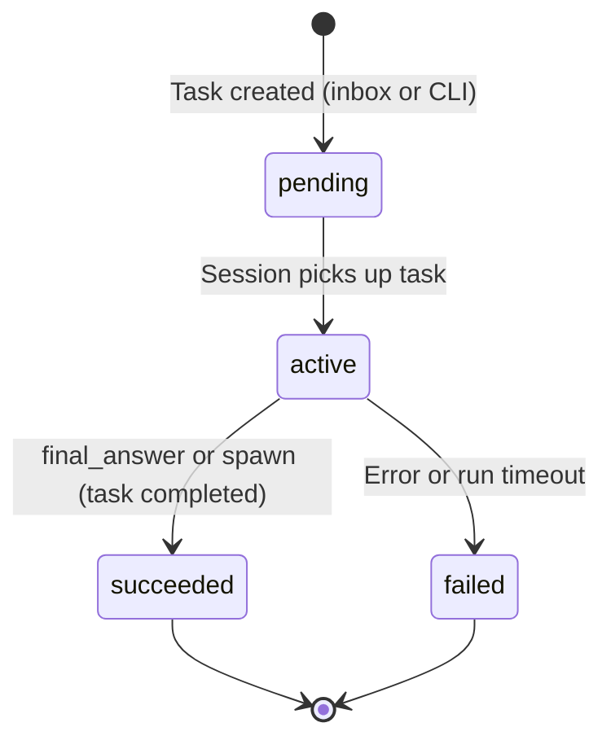
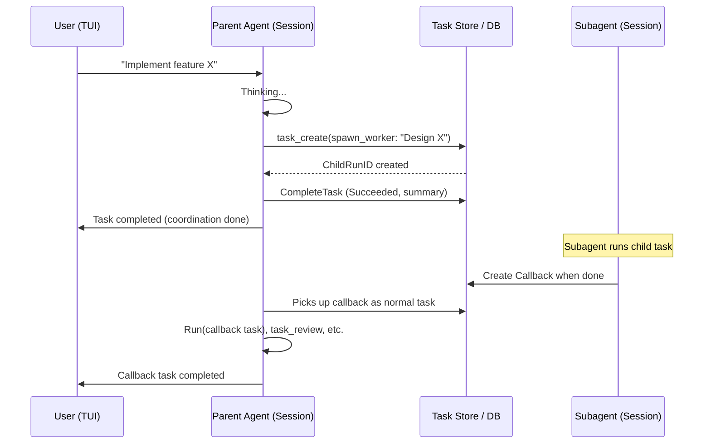

# System Architecture Overview

This document provides a high-level view of the Workbench architectural components and their interactions during the lifecycle of a task.

## Component Map

**Session Service** (`pkg/services/session`): The daemon and RPC access all session and run data only through this service. It is implemented by the **Manager**, which uses a Store (SQLite or in-memory) and the RuntimeSupervisor for stop/delete. See [pkg-services-session](pkg-services-session.md) for the full API and diagrams.

## Global Task State Machine

The workbench transitions tasks through the following lifecycle. Coordination tasks complete in Succeeded/Failed/Canceled; callbacks are separate tasks.

## Subagent Spawn and Callback Flow

The following sequence illustrates the flow from a user's initial request through a subagent spawn and callback processing.

## System-Wide Invariants

1.  **Isolation**: Every agent run must operate within a unique `Runtime` with its own VFS and resource limits.
2.  **Statelessness**: The `agent.Loop` should remain stateless; all persistence and memory must be externalized to the `Store` or `TaskStore`.
3.  **Traceability**: Every host operation must emit an event that can be traced back to a specific `RunID` and `SessionID`.
4.  **Consistency**: Task state transitions are governed by the `session` and must be atomic within the underlying `TaskStore`.
